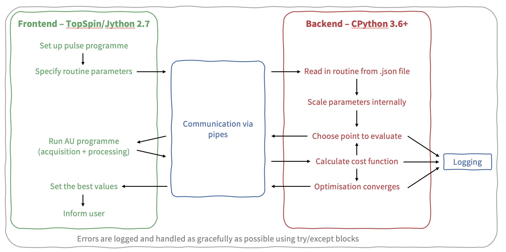

Developer notes
===============

POISE does not contain all that much code.
However, if you are thinking of modifying it, it helps to have an understanding of the distinction between the *frontend* and the *backend*.
This graphic (taken from an old presentation) is a slightly more technical description of the flowchart presented in the POISE paper, and shows which part is responsible for which step.
It's a good starting point for understanding how POISE works internally.

Beyond this, we recommend reading the source code of POISE: start at the frontend script (``poise.py``, which is run from inside TopSpin), then go to the backend script (``poise_backend/backend.py``) at the appropriate time (when the frontend launches it as a subprocess).
The source code is quite thoroughly commented.

There are two main things to point out.
Probably the most important thing worth mentioning is the location of the relevant files.
The backend script is always ran from ``$TS/py/user/poise_backend`` (putting it here allows the frontend to access itmuch more easily).
The entire ``$TS/py/user/poise_backend`` folder is treated as if it is a Python package, by virtue of some code near the top of ``poise_backend.py``::

    if __name__ == "__main__" and __package__ is None:
       __package__ = "poise_backend"
       sys.path.insert(1, str(Path(__file__).parents[1].resolve()))
       __import__(__package__)

This allows relative imports of the other files in the same directory, such as ``costfunctions.py``, in which the user-defined cost functions reside.

.. note::
   These backend files *also* reside inside the Python 3 ``site-packages`` directory, where all packages are installed to. However, these files will *never* be used by POISE. So, there is nothing to be gained by modifying these at all.

   The only file inside the ``site-packages`` directory which has any effect is ``nmrpoise/__init__.py``, where the ``parse_log()`` function is defined. This allows you to (for example) run::

      >>> from nmrpoise import parse_log

   Python will look inside the ``site-packages`` directory, *not* ``$TS/py/user``, to find this function.

The second thing is that you should never, ever, do anything with the backend's ``stdin`` and ``stdout``, because these are exclusively reserved for communication with the frontend.
So you should never print anything from the backend, since the frontend will just interpret that as an error.
This applies to all files inside the ``$TS/py/user/poise_backend`` directory, including cost functions, which is why custom cost functions should always use POISE's `log` function instead of plain old `print`.

.. note::
   If you really just want to do some quick-and-dirty debugging, you *can* actually use this behaviour to your advantage. The frontend will echo any "invalid" message it receives from the backend, so if you print some unexpected text from the backend (on purpose), you should see it pop up as a TopSpin message when you run an optimisation. This is slightly less hassle than printing to a file and opening the file.

Testing
-------

Tests are carried out using the excellent `pytest <https://docs.pytest.org/en/stable/>`_ and `tox <https://tox.readthedocs.io/en/latest/>`_ tools.
To run all tests, simply run::

   tox

from anywhere inside the ``nmrpoise`` directory.
This runs tests on Python 3.6, 3.7, and 3.8.
If you only have one of these versions, use::

   tox -e py38   # or py36 or py37

To build the Sphinx documentation, use::

   tox -e docs

The HTML documentation will be built in ``docs/_build``, and the PDF documentation in ``docs/latex`` (this assumes you have a working installation of ``pdflatex`` on your system).
