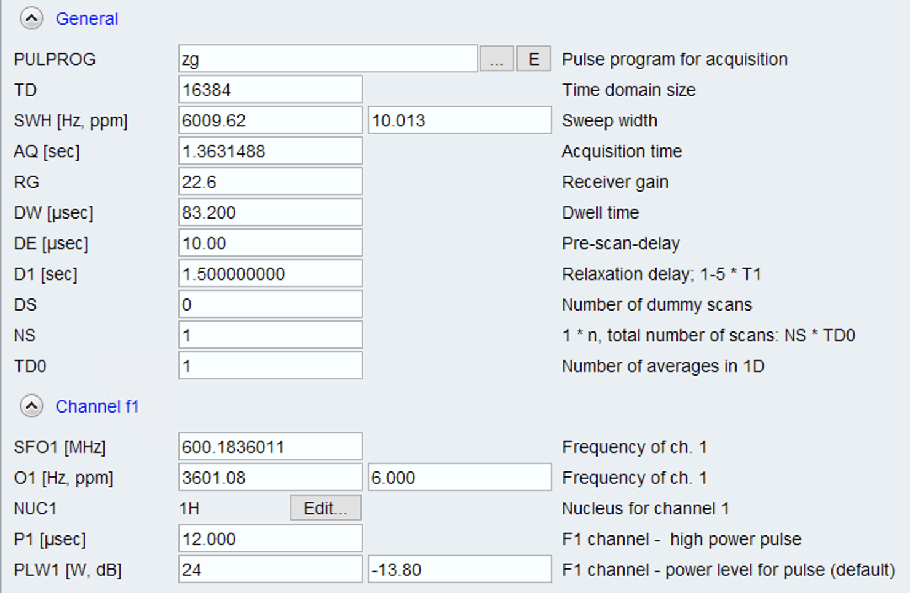
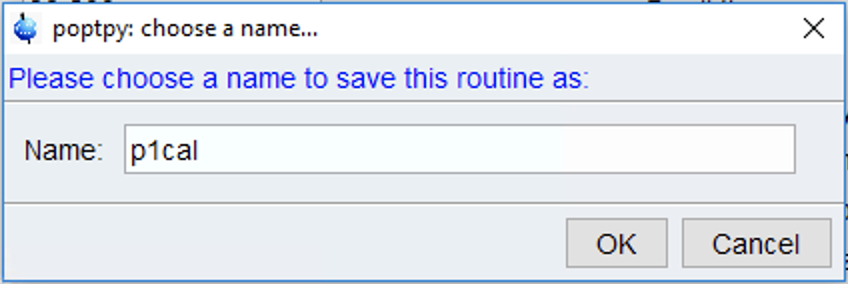
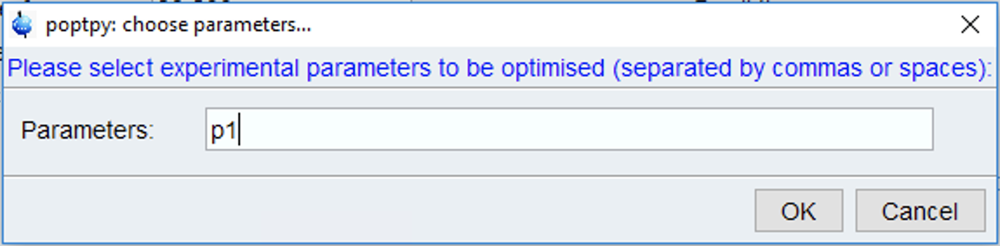
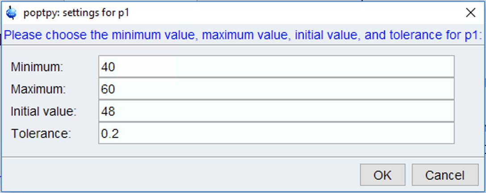
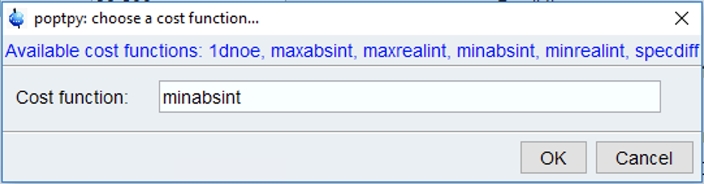
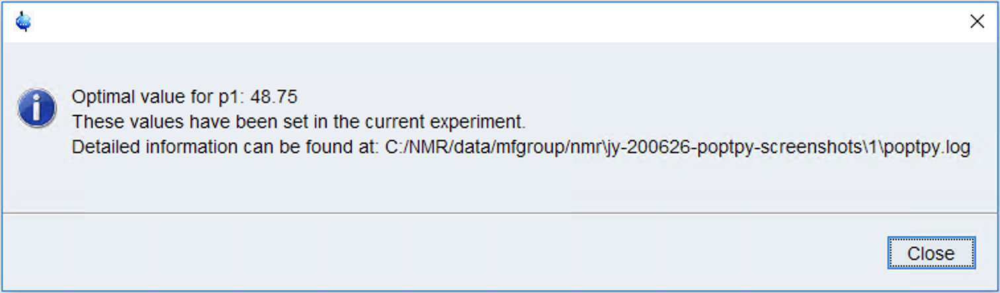
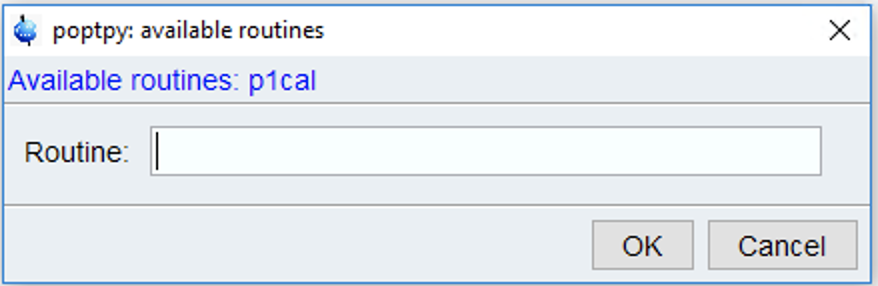

Optimisations
=============

Overview
--------

In order to carry out an optimisation, the user needs specify several pieces of information, namely:

1. The **parameters** to be optimised (e.g. ``p1``).
2. The **lower and upper bounds** (e.g. approximately ``35`` and ``45``, if one is calibrating the length of a 360-degree pulse).
3. The **initial values** (this should be your best guess at the final answer).
4. The **tolerances** (how much of a difference from the "true" answer you are willing to accept).
5. The **cost function** (what function you will use to evaluate how "good" each spectrum is).

.. note::
   A cost function is always *minimised* during the course of an optimisation.
   Consequently, it should technically be a measure of how *bad* the spectrum is.
   If you are using the inbuilt cost functions, this is not an issue.
   However, if you are :ref:`writing your own cost functions <own_cf>`, do make sure you are using the correct sign.

In this programme, a collection of these five items is referred to as a **routine**. Routines can be stored and ran multiple times (e.g. on different samples). On top of the five items listed, each routine is also associated with a name.

Running an optimisation
-----------------------

In this section we will illustrate how to set up a new optimisation routine, using the slightly trivial example of calibrating a proton 90° pulse.
Usually this calibration is done not by measuring the 90° pulse width itself, but rather by looking for a *null* in the intensity corresponding to (e.g.) a 360° pulse.
The 90° pulse width is then just one-quarter of the 360° pulse width.

.. note::
   **We strongly recommend turning on TopSpin's "unsafe ZG" option (TopSpin preferences > Acquisition), at least while running the optimisation.**

   Otherwise, on *every* function evaluation, TopSpin will ask for confirmation as to whether you really want to acquire a new spectrum, and the optimisation will not proceed until you click "Yes".

We start by setting up the pulse programme to be used for optimisation. In this case it is a proton pulse-acquire spectrum, i.e. ``zg``. On virtually all spectrometers ``NS=1`` and ``DS=0`` should suffice. In general, to save time, you should seek to minimise the duration of each individual experiment, as long as there is sufficient signal-to-noise.

Once this is done, launch the programme by typing ``poptpy`` into the TopSpin command line (or ``xpy poptpy`` if there is a name collision).
The first time you run this there will not be any saved routines, so ``poptpy`` will prompt you to enter a name for a new routine. We will choose ``p1cal``:

Then enter the parameters to be optimised:

The ``prosol`` value of ``p1`` was 12 us, so we will search for a solution between 40 and 60 us. 
Our initial guess will be 48 us.
You can choose the tolerance depending on how accurate an answer you want.
(Note that a 0.2 us tolerance in the 360° pulse width corresponds to a 0.05 us tolerance in the 90° pulse width.)

.. note::
   The units used here are always the same as the Bruker defaults. Pulses are in microseconds, whereas delays are in seconds.
   As a convenience function, ``poptpy`` also allows you to specify pulse or delay durations using Bruker's syntax of ``u``/``m``/``s``.

Finally, we will choose ``minabsint`` as the cost function.
This refers to *minimising* the *absolute intensity* of the spectrum (using the absolute value of the intensity, instead of just the intensity of the real part of the spectrum, avoids any phase issues):

The programme then proceeds to carry out the optimisation. Since we started from a fairly optimal value, it converges rather quickly. In our case it took 12 function evaluations and approximately 1.5 minutes.

A detailed log of the optimisation process is stored in the EXPNO folder (the link is given in the final dialog box).

Reusing a routine
-----------------

Once you have created a routine, ``poptpy`` will store it in its list of saved routines. When you next run ``poptpy``, it will ask you whether you want to used a saved routine:

Alternatively, if you remember the name of the routine, you can simply include it in the TopSpin command line.
Typing ``poptpy p1cal`` will launch you straight into the optimisation, using the same values specified earlier.

Stopping an optimisation
------------------------

Perhaps you didn't like the values you chose, or somebody else needed the spectrometer.
Or maybe there was a bug, in which case we would really appreciate it if you :doc:`told us <contact>`!

Typing the ``stop`` command will prematurely end the current acquisition, but does not stop the Python script from continuing. (We plan to fix this in the near future.)
You can use the TopSpin ``kill`` command to terminate the Python script running inside TopSpin (select ``xpy`` from the menu).
This should automatically take care of the background Python 3 process as well.
