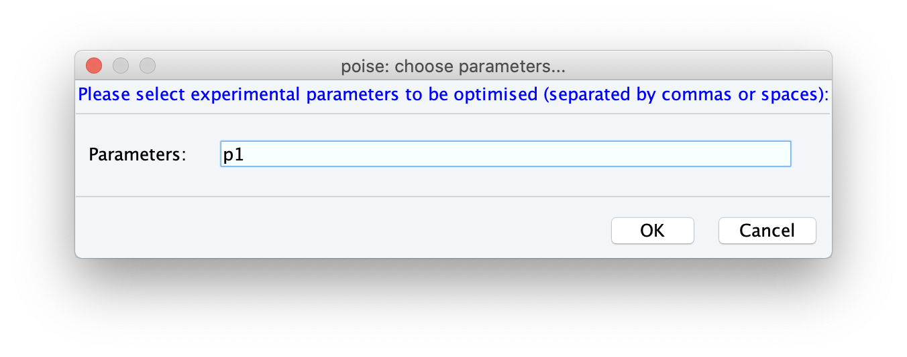
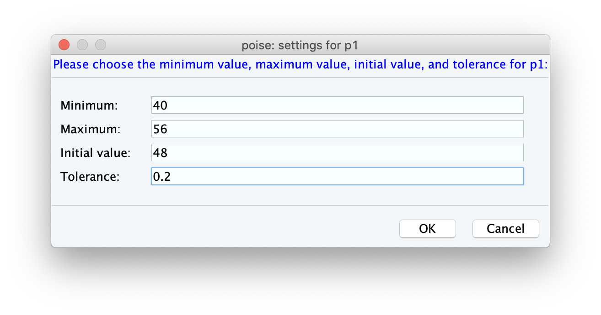
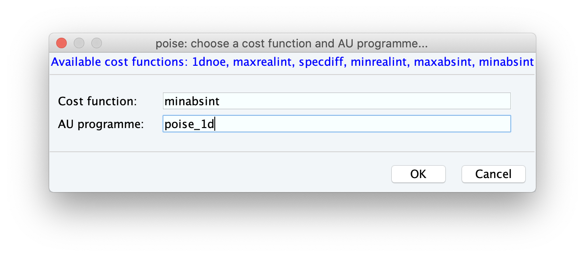
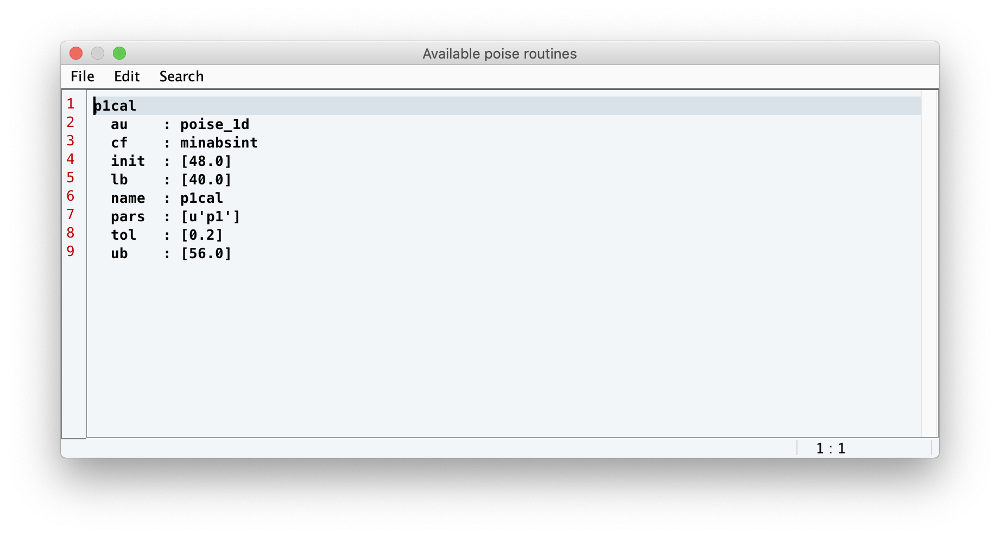

Setting up a Routine
--------------------

If you're coming here from the `install`, you should make sure that POISE has been installed correctly.
A simple check is to type in ``poise -l`` into the TopSpin command line: if it shows a text box, then you should be good to go.

Each optimisation in POISE is controlled by a **routine**, which contains all information necessary for an optimisation.
The ingredients of a routine are:

 - A name
  
 - The parameters to be optimised

 - Lower bounds, upper bounds, initial values, and tolerances for each parameter

 - A cost function which determines the 'badness' of a spectrum

 - The name of an AU programme for acquisition and processing

We will now walk through how to set a routine up, elaborating on each of these ingredients as we come to them.
To get this process started, type ``poise --setup`` into the TopSpin command line (the ``--setup`` flag allows us to create a routine without actually running the optimisation).

.. note::
   If you're interested in finding out what all these command-line options do, ``poise -h`` will give you a short summary of each of them.

---------------

The routine we will set up now is one for the calibration of the 360° pulse width.
The first ingredient we need to provide is a **name**.
I've used ``p1cal`` for this, but of course you can choose anything you prefer:

.. image:: images/routine1.png
   :align: center

After clicking OK, you will be prompted to provide the **parameters** that are being optimised.
Here we are just optimising one parameter, ``p1``.

.. note::
   Only parameters that take on float values can be optimised (pulses ``p``, delays ``d``, constants ``cnst``...) Integer values, like ``td`` or loop counters ``l``, will not work.

At this stage, you will be prompted to enter the **bounds**, **initial value**, and **tolerances**.
The lower and upper bounds simply reflect a range within which the optimum can reasonably be assumed to lie within, and the initial value should be your best guess at where the optimum is.
In this case, the Prosol value for a 90° pulse is 12 µs, so we'll go ahead and set the initial guess for the 360° pulse to be 48 µs.
The lower and initial bounds can be 40 and 56 µs respectively (corresponding to a 90° pulse of between 10 and 14 µs).
The tolerance, on the other hand, roughly reflects the degree of accuracy that you want in the answer. Here we've used a value of 0.2 µs.

Choosing tolerances can be tricky sometimes.
Too large a tolerance can lead to inaccurate answers (as the optimisation converges before it's really found the minimum); and too small a tolerance is meaningless, as often the resulting spectra are barely different.
Generally, it's a good idea to choose the smallest value where going in either direction will give you an appreciable difference in the spectrum.
However, it doesn't have to be *too* precise: as long as you aren't off by an order of magnitude POISE will still work reasonably well.

.. note::
   The default TopSpin units for pulse lengths are microseconds, so the unitless ``48`` is equal to 48 µs. However, for delays the default units are seconds.

   POISE also allows you to specify units using the suffixes 'u', 'm', and 's' for microseconds, milliseconds, and seconds respectively. This is designed to mimic TopSpin's parameter settings, where ``30m`` means 30 ms (for example). So you can enter ``48u`` in this screen as well, or indeed ``0.048m``.

Finally, we have to choose a **cost function**, as well as an **AU programme**.
Both of these depend on exactly *how* we are going to evaluate whether the value of ``p1`` is good or not.
In our case, we will use the ``zg`` pulse programme — a simple proton pulse-acquire.

The cost function is a Python function which reads the spectrum and returns a *'cost'*, i.e. how bad the spectrum is.
All optimisations in POISE seek to minimise the cost function.
In our case, the best value of ``p1`` is one for which the spectral intensity is minimised (i.e. magnetisation is returned to the positive *z*-axis).
So, we can conveniently use the intensity of the magnitude-mode spectrum as the cost function.
This cost function is also bundled with POISE, and is called ``minabsint``.
(For those who are familiar with TopSpin's built-in ``popt``, this is equivalent to the ``MAGMIN`` criterion.)

.. note::
   For more information about the built-in cost functions, check out `costfunctions`.

The corresponding AU programme simply needs to acquire the spectrum, then process using Fourier transform, phase correction, and baseline correction.
POISE is bundled with one such AU programme, called ``poise_1d``, which performs all this.

That's it — congratulations, you've set up a POISE routine!
If you type ``poise -l`` now, you should now see the ``p1cal`` routine (or whatever you named it) appear in the text box:

