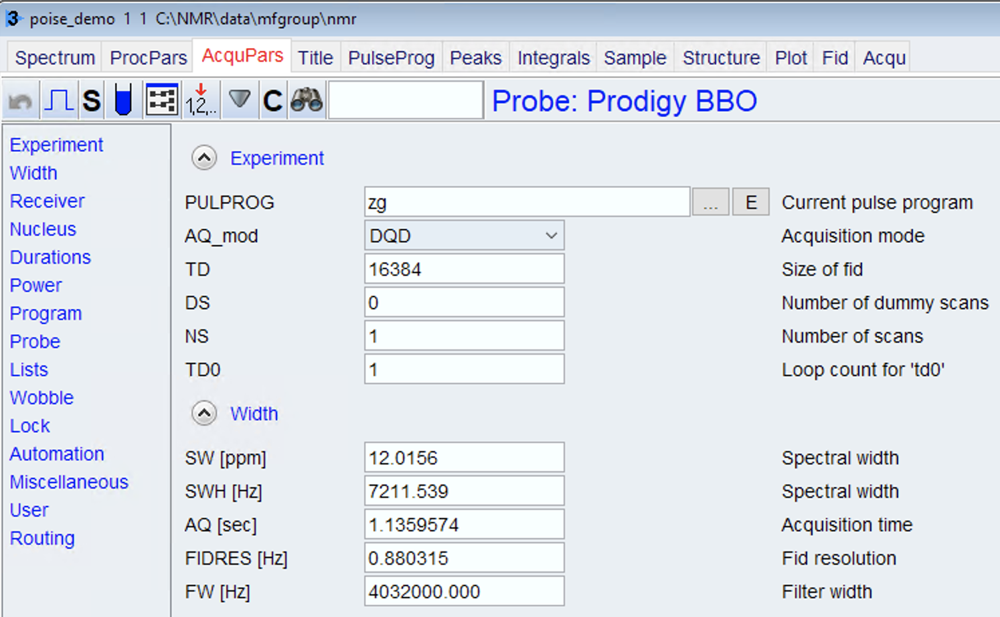
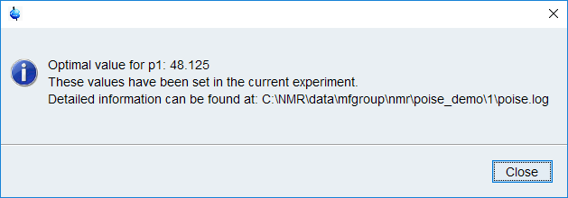

Running an optimisation
-----------------------

Assuming you've already created a routine (see `routines` if not), this page will show you how to run the optimisation.
We'll use the same ``p1`` calibration routine that we described before, but the principles apply equally to all routines.

The first thing to do is to set up the NMR experiment.
Use ``edc`` or ``new`` to create a new proton pulse-acquire experiment.
You should use the pulse programme ``zg`` (not ``zg30`` or ``zg60``!).
Set the other experimental parameters, such as the spectral width ``SW``, relaxation delay ``d1``, etc. as desired for your compound of interest.

All these steps can in principle be done most easily by loading a parameter set (``rpar``).
On Bruker systems, there should already be a default ``PROTON`` parameter set; or there might be one that has been set up by a member of the NMR staff.

.. note::
   Apart from the pulse programme, basically every other parameter can be set to whatever you like.
   However, to reduce the overall time taken, it's generally a good idea to try to make each experiment as short as possible.
   In this case, even with very dilute samples, 1 scan will suffice.
   You could cut this even further by lowering ``TD`` to 8192 (for a given ``SW``, this translates to a shorter acquisition time ``AQ``).

   **For routine usage we recommend using at least 1 dummy scan.** This (``p1cal``) is the only optimisation example in which we have used 0 dummy scans.
   Skipping dummy scans altogether can lead to inaccuracies in the cost functions (as the system has not reached a steady state).

Lock, shim, and tune as usual (if you haven't already).
Once that's done, simply enter into the TopSpin command line::

    poise p1cal

Sit back and watch it run!
You should get a result in 1–2 minutes.

The best value(s) will automatically be stored in the corresponding parameter so that any subsequent acquisition will use the optimised parameters.

Running under automation
========================

It is possible to run POISE under automation, by incorporating it into an acquisition AU programme (the ``AUNM`` parameter in TopSpin).
(An example of a DOSY acquisition script is presented in the paper.)
To do so, you can use the syntax::

    XCMD("sendgui xpy poise <routine_name> -q [options]")

inside the AU script.
(Yes, this creates an AU script which runs a Python script which runs an AU script.)
The ``-q`` flag (or equivalently ``--quiet``) ensures that POISE does not show the final popup informing the user (this popup has to be dismissed before anything else can be done).

Parsing the log
===============

If you are interested in analysing data from (possibly multiple) optimisation runs, all information is logged in a ``poise.log`` file.
This log file can be parsed using a Python 3 script::

   >>> from nmrpoise import parse_log
   >>> # pass it the path to poise.log, or to the directory containing it
   >>> parse_log("C:/NMR/data/mfgroup/nmr/poise_demo/1")
     routine  initial param    lb    ub  tol algorithm     costfn    auprog  optimum         fbest  nfev  time
   0   p1cal     48.0  [p1]  40.0  56.0  0.2        nm  minabsint  poise_1d   48.125  6.849146e+06    10    77

`parse_log` returns a pandas DataFrame object which contains most of the information in the log file.
However, this object does not include details of individual cost function evaluations (even though these are fully logged).
If you want to analyse that data, you will have to write your own function!

The full documentation for `parse_log` (which really doesn't say much more than the previous example) is as follows:

.. currentmodule:: nmrpoise

.. autofunction:: parse_log

Errors
======

POISE tries its best to exit gracefully from errors, and often you won't need to care about any of them.
However, if something *does* go wrong during an optimisation, errors will be logged to the two files ``poise_err_frontend.log`` and ``poise_err_backend.log``, depending on which script runs into an error.
These files reside in the same folder as ``poise.log``, i.e. the "expno folder".
We welcome bug reports — please submit an issue on `GitHub <https://github.com/yongrenjie/nmrpoise/issues>`_ or drop us an email (replace AT with @):

.. raw:: html

   jonathan.yong AT chem.ox.ac.uk mohammadali.foroozandeh AT chem.ox.ac.uk
